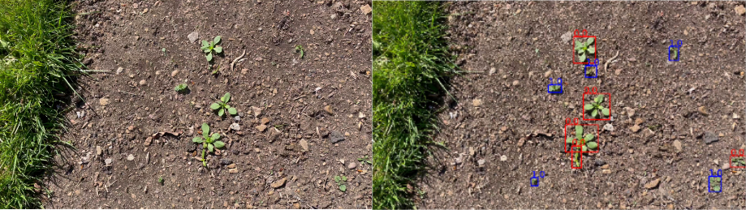

# lincolnbeet_dataset

The lincolnbeet dataset is an object detection dataset designed to encourage research in the identification of items in environments with high levels of occlusion, and in the development of better approaches to evaluate object detection models in practical scenarios. This dataset was introduced in the paper:

***"Self-supervised Representation Learning for Reliable Robotic Monitoring of Fruit Anomalies"***. Adrian Salazar-Gomez, Madeleine Darbyshire, Junfeng Gao, Elizabeth I Sklar, and Simon Parsons. 

You can find the paper on [[arXiv]](https://arxiv.org/abs/2109.11048). Currently, this work has been submitted to the IEEE for possible publication and the copyright may be transferred without notice, after which this version may no longer be accessible.


# Download link and dataset reference
The dataset contains 4402 images that contain weed plants and sugar beets which are located with object detection labels. The image size is 1920 x 1080 pixels, and the labels included in the dataset are in COCOjson, XML, and darknets formats. To download the dataset, please click on the following link.

https://www.dropbox.com/s/0rq7cc8t6rja632/all_fields_lincolnbeet.zip?dl=0

If you are using the dataset, please do not forget to cite it using the following bib entry:

```
@article{2021towards,
  title={Towards practical object detection for weed spraying in precision agriculture},
  author={Salazar-Gomez, Adrian and Darbyshire, Madeleine and Gao, Junfeng and Sklar, Elizabeth I and Parsons, Simon},
  journal={arXiv preprint arXiv:2109.11048},
  year={2021}
}
```

# How to use the dataset and dataset structure.
Once you have the .zip file that you got from the [[DATASET LINK]](https://www.dropbox.com/s/0rq7cc8t6rja632/all_fields_lincolnbeet.zip?dl=0), unzip the zip file to get a folder called "all_fields_lincolnbeet". The structure of the folder is as follows:


```

all_field_lincolnbeet                             #Dataset folder.
│
└───all                                          #Folder that contains the dataset images and the xml and darknet labels
│
|   └───.png files                                #Dataset images
│   └───.txt files                                #Object detection labels in darknet format.
|   └───.xml files                                #Object detection labels in xmlVOC format.
|
└───all_fields_lincolnbeet_test_.json             #List, in json format, of all the images used for testing in the dataset paper.
└───all_fields_lincolnbeet_train_.json            #List, in json format, of all the images used for training in the dataset paper.
└───all_fields_lincolnbeet_val_.json              #List, in json format, of all the images used for validation in the dataset paper.
└───all_fields_lincolnbeet_test_.txt              #List, in txt format, of all the images used for testing in the dataset paper.
└───all_fields_lincolnbeet_train_.txt             #List, in txt format, of all the images used for training in the dataset paper
└───all_fields_lincolnbeet_val_.txt               #List, in txt format, of all the images used for validation in the dataset paper
└───all_fields_lincolnbeet.json                   #Object detection labels in COCOJSON format
└───json_test_set.json                            #Object detection labels for the testing set in COCOJSON format.
└───json_train_set.json                           #Object detection labels for the training set in COCOJSON format.
└───json_val_set.json                             #Object detection labels for the validation set in COCOJSON format.

```


# Characteristics of the dataset 
Below, you can find a summary of the overal characteristics of the dataset.
|  dataset characteristics |  Lincolnbeet | 
|---------------- | ------|
| **Number of images** | 4402 | 
| **Number of items**  | 39246  | 
| **Average percentage of the bounding box that is occluded** | 0.0176|
|**Average area of the imageoccupied by bounding boxes**    | 0.0717|


In addition, we provide the characteristics of each of the classes within the dataset.


|                 |  Sugar beet  | weed plants |
|---------------- | ------|------|
| **Number of items** | 16399   | 22847  | 
| **Average area occluded in the bounding boxes **| 0.0324 | 0.001  | 
| **Average image area occupied by item bounding box **| 0.033 | 0.002  | 
 

# Contact
If there is any questions about the dataset, please do not hesitate to drop an email to asalazargomez@lincoln.ac.uk.
